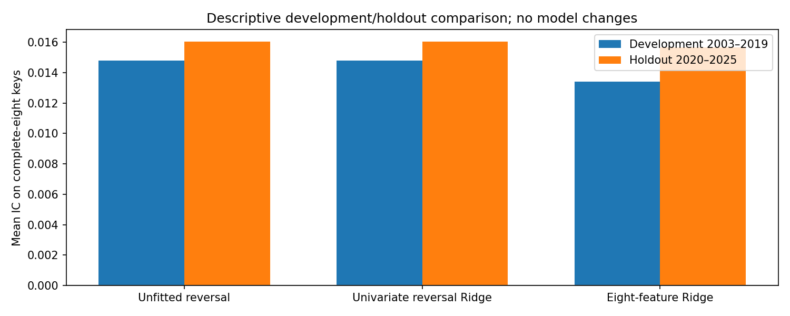
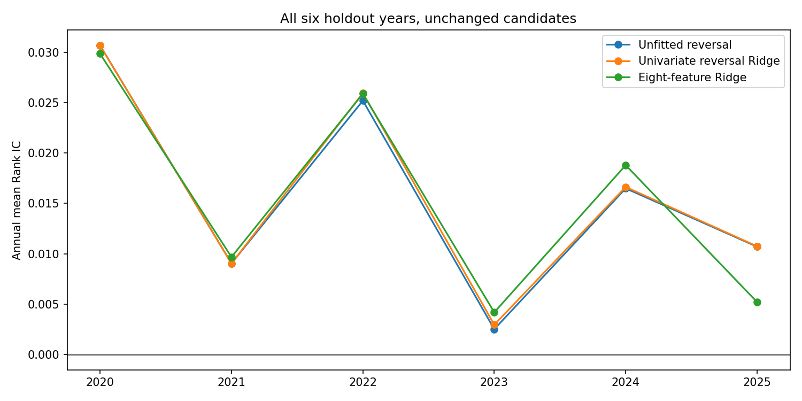
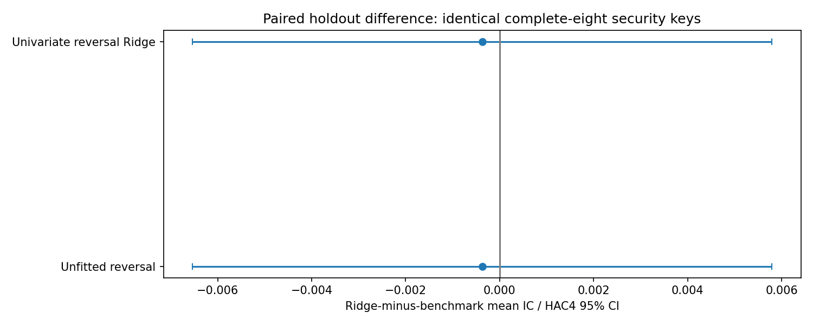
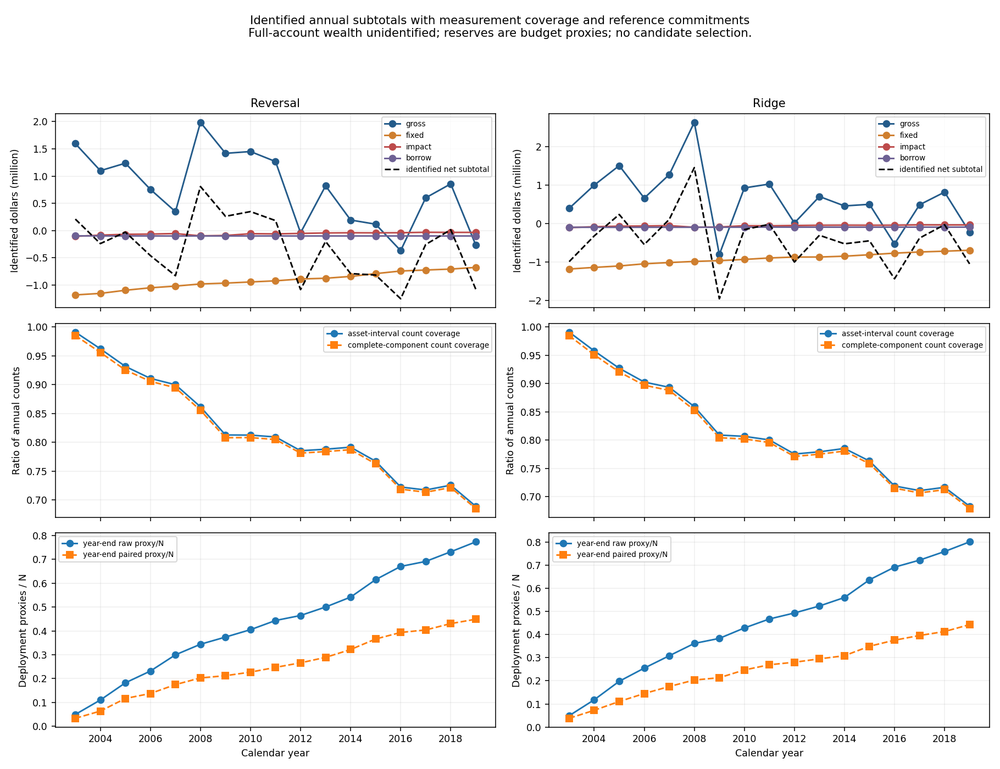

# Short-Horizon Cross-Sectional Equity Alpha

**Forecasting, Walk-Forward Validation, and Execution-Aware Portfolio Analysis**

Minhao Qian · Final research release · October 2026

Can short-horizon equity forecasts generate economically meaningful market-neutral alpha after realistic risk controls and transaction costs? This CRSP CIZ study follows US equity signals from point-in-time construction through five-day forecasting and execution-aware accounting. Reversal retains positive predictive information out of sample; additional Ridge complexity has no demonstrated incremental ranking advantage. Profitable full-account implementation is **not established**.

## Full Paper

**[Read the full research paper (PDF)](paper/Minhao_Qian_Short_Horizon_Equity_Alpha_Final.pdf)** · [Editable paper (DOCX)](paper/Minhao_Qian_Short_Horizon_Equity_Alpha_Final.docx) · [Paper figures](paper/figures)

## Key Findings

- **Persistent short-term reversal:** mean Rank IC is 0.015817 in the final 2020–2025 predictive holdout. Every candidate has positive mean IC in all six years and all five fixed nonoverlapping phases; individual year/phase confidence intervals often include zero.
- **Complexity does not demonstrate added value:** eight-feature Ridge has holdout mean IC 0.015672. On identical complete-eight keys, Ridge-minus-reversal mean IC is −0.000371, with HAC4 95% CI [−0.006534, 0.005792]. No winner is selected.
- **Costs dominate identified gross components:** in the conditional 2003–2019 implementation, fixed charges alone exceed identified gross contribution for both candidates. Conditional means are −1.220 / −1.718 bp/day relative to fixed $10m reference capital.
- **Full-account net alpha remains unidentified:** unresolved corporate-action inventory, claims and obligations remain explicit. Partial contributions cannot establish total returns, NAV, Sharpe, drawdown, funding, realized neutrality or solvency.

## Methodology

| Component | Frozen specification |
|---|---|
| Market and data | Daily US equities; CRSP CIZ, 1993–2025 |
| Universe | Point-in-time ordinary US common equity; US incorporation, corporate issuers, NYSE/AMEX/Nasdaq and active status |
| Liquidity | Price > $5; market cap > $1bn; ADV20 > $20m; at least 15 valid observations in 20 global trading days |
| Timing | Information through close t; signal after close t; entry open t+1; planned exit open t+6 |
| Target | Five-day corporate-action-aware wealth return; no reinvestment; zero interest on cash; verified quantities and measurable claims |
| Features | Reversal, momentum, volatility, turnover, dollar liquidity, volume shock, overnight gap, intraday return |
| Preprocessing | Date-local 1st/99th percentile clipping and population-SD standardization; no pooled scaling or filling |
| Model | Quarterly expanding Ridge; normalized λ = 1; equal-date raw-return squared loss; unpenalized intercept; complete-eight inputs |
| Forecast evaluation | Average-tied Spearman Rank IC, minimum 30 pairs; HAC4 primary, fixed HAC20 sensitivity; all five calendar phases |

All **6,699,101 original eligible keys** remain present; **6,676,750 numeric labels** (99.666358%) are measurable. Missing labels retain reasons. Label availability and event outcomes never select signal eligibility or serve as predictors. Complete-case evaluation remains conditional on measurability.

The [methodology contract](docs/methodology.md), [feature definitions](docs/stage2a_feature_framework_proposal.md) and [research log](docs/research_log.md) preserve decisions and failures. The squared-error training objective and Rank-IC evaluation metric intentionally differ.

## 2020–2025 Holdout

The final predictive holdout was opened once after specifications were frozen and is now **evaluated and closed**. It is not an untouched tuning resource. The 24 quarterly expanding fits use only labels whose exit and ledger information have matured by the prior-quarter close. Mature earlier holdout labels enter later training under the frozen updating rule: this is a prequential evaluation, not a fixed-coefficient 2019 model.

**1,882,649 eligible keys; 1,872,680 numeric labels; 9,969 explicit missing labels.** All 1,508 signal dates remain present, with 1,502 defined-IC dates. The last six dates have no numeric targets because of endpoint censoring.

| Candidate | Mean Rank IC | HAC4 95% CI | HAC4 t | HAC20 t | Evaluated / eligible keys |
|---|---:|---:|---:|---:|---:|
| Unfitted signed reversal | 0.015817 | [0.002263, 0.029371] | 2.287 | 2.157 | 99.4474% |
| Univariate reversal Ridge | 0.016043 | [0.002477, 0.029609] | 2.318 | 2.183 | 97.8928% |
| Eight-feature Ridge | 0.015672 | [0.003927, 0.027417] | 2.615 | 2.495 | 97.8928% |

Primary summaries use each candidate's available sample; incremental comparisons use identical keys. Univariate and unfitted reversal rankings agree on the matched sample. Aggregate quintile target contrasts are 25.22 / 25.77 / 20.76 bp for reversal / univariate / Ridge; **these are predictive target contrasts, not portfolio returns**. Confidence intervals are nominal and not multiplicity-adjusted discoveries.

The 2003–2019 forward-development mean ICs were 0.015021 / 0.014787 / 0.013399. The broader 1993–2019 Stage2B reversal mean (0.029921) is a different sample and remains separately labeled.

[Holdout completion and QA](docs/stage5_completion.md) · [Aggregate tables](results/tables/stage5) · [Development evaluation](docs/stage3a_completion.md)

## Execution-Aware Portfolio Results

The development-only portfolio design uses five overlapping sleeves, top/bottom tied quintiles, equal paired planned dollar deployment, $10m reference capital, 2% sleeve-side name caps and 1% ADV flow constraints. Shares are set at the decision close. Opening gaps and unknown positions prevent certification of realized neutrality; beta and sector neutrality are deferred.

Frozen conditional assumptions include a 6 bp one-way fixed allowance, impact of 0.10 × raw daily sigma20 × sqrt(participation), and 100 bp/year ACT/365 borrow on verified original short-entry notional. CRSP opens are benchmark prices, not certified broker fills or locates.

Strict identification stops new orders after close **2003-01-13** with no identified resumption through 2019. A five-global-date fallback subsequently fails on unverified successor quantities after close **2003-03-31**. Legal entitlement does not establish actual account delivery or fractional settlement. Later conditional settlement scenarios also fail at a separate merger. These failures are preserved.

Generalized quarantine/reservation permits reference-budget continuation, but reserves are **not wealth, collateral or loss bounds**. Stage4G reports only identified signed components, with unknown residuals kept null and known costs/claims retained even when related wealth is unknown.

| Conditional development component, 2003–2019 | Reversal | Eight-feature Ridge |
|---|---:|---:|
| Identified gross contribution | $13.07m | $10.82m |
| Identified fixed charges | −$15.58m | −$15.56m |
| Identified impact costs | −$1.01m | −$1.00m |
| Identified borrow costs | −$1.70m | −$1.61m |
| Identified net subtotal | −$5.22m | −$7.35m |
| Conditional daily mean / fixed N | −1.220 bp | −1.718 bp |
| Identified asset-interval count coverage | 80.5789% | 79.9866% |
| End-date asset-interval count coverage | 69.1160% | 68.4329% |

All 4,278 reporting dates are retained. Coverage is a count proxy, not a market-value fraction. No coverage rescaling, compounding or synthetic equity curve is applied. HAC20/HAC4 inference concerns only conditional component means; annualized contribution SD is not portfolio volatility. **There is no 2020–2025 portfolio backtest or full-book profitability claim.**

[Portfolio protocol](docs/stage4a_portfolio_protocol.md) · [Strict feasibility failure](docs/stage4a_continuation_feasibility.md) · [Reservation audit](docs/stage4f_reservation_completion.md) · [Conditional accounting results](docs/stage4g_completion.md) · [Aggregate tables](results/tables/stage4g)

## Figures

Forecast diagnostics and partial implementation evidence are shown separately. No figure is a full-strategy equity curve.









[All holdout figures](results/figures/stage5) · [All conditional implementation figures](results/figures/stage4g) · [Four paper figures](paper/figures)

## Limitations

- Static CRSP extracts do not establish revision-free historical publication vintages, despite effective-date and maturity controls.
- Missing labels/features and unresolved wealth are nonrandom; complete-case IC and measured components do not identify full-universe or full-account performance.
- Legal corporate-action terms can leave election, executable successor quantity, delivery, fractional cash and short obligations unknown. No retrospective disappearance or unsupported write-off is allowed.
- Modeled execution, impact, borrow and auction access are conditional assumptions. Historical locates, recalls, actual invoices and funding are not certified.
- Risk controls are limited to the frozen design; realized dollar, beta and sector neutrality are not established for the unknown book.
- Holdout years/phases vary materially, and nominal inference does not resolve measurement selection, nonstationarity or multiple comparisons.
- Results establish positive average prediction, no demonstrated incremental Ridge value, and **no established profitable complete implementation**. No further model, feature, horizon or accounting search is authorized by publication.

## Reproducibility

The public repository contains code, tests, protocols and aggregate research outputs. **Licensed CRSP security/cohort row-level data, predictions, labels, journals, manifests with private inputs and credentials are excluded.** Authorized CRSP access and the documented local caches are required for empirical reproduction; this is not a download-and-run public dataset.

```bash
python3 -m venv .venv
source .venv/bin/activate
python -m pip install -r requirements.txt
python -m pytest -q
```

The following routes document the completed pipeline. Empirical commands require matching licensed local inputs; they are not permission to tune or reopen the holdout.

| Stage | Entry point | Audit record |
|---|---|---|
| Frozen target | `scripts/20_construct_stage1g_targets.py` | [Target contract](docs/methodology.md) |
| Features and QA | `scripts/26_construct_stage2a_features.py`, `27_report_stage2a_features.py` | [Stage2A](docs/stage2a_completion.md) |
| Fixed development baselines | `scripts/29_evaluate_stage2b_baselines.py` | [Stage2B](docs/stage2b_completion.md) |
| Expanding development Ridge | `scripts/30_walk_forward_stage3a.py` | [Stage3A](docs/stage3a_completion.md) |
| Reservation feasibility | `scripts/36_stage4f_reservation_feasibility.py` | [Stage4F](docs/stage4f_reservation_completion.md) |
| Conditional components and reports | `scripts/37_stage4g_measured_components.py`, `38_report_stage4g_components.py` | [Stage4G](docs/stage4g_completion.md) |
| Saved holdout report QA | `scripts/40_report_stage5_holdout.py` | [Stage5](docs/stage5_completion.md) |

`scripts/39_stage5_predictive_holdout.py` verifies/resumes the original single-opening manifest; a completed run returns without refitting. Do not remove the manifest or create a second opening. At Stage5 closure, **195 tests passed**, 144 files were checksum-verified, 2,400 forecasts were independently reconstructed exactly, and all 24 maturity audits had zero violations.

## Repository Map

- `paper/`: final PDF, editable DOCX and aggregate paper figures
- `docs/`: locked methodology, protocols, completion reports and numbered research decisions
- `src/`: reusable data, feature, evaluation and accounting logic
- `scripts/`: reproducible pipeline entry points
- `tests/`: timing, leakage, key, missingness and accounting integrity tests
- `results/tables/`, `results/figures/`: public aggregate evidence
- `data/raw/`, `data/interim/`, `data/processed/`: local licensed inputs and intermediates, ignored by Git
- `notebooks/`: exploratory diagnostics

The project is at its final synthesis boundary. Historical approval language in stage documents describes those stages at the time; the completed single Stage5 opening supersedes earlier untouched-holdout wording only for the authorized predictive evaluation.
